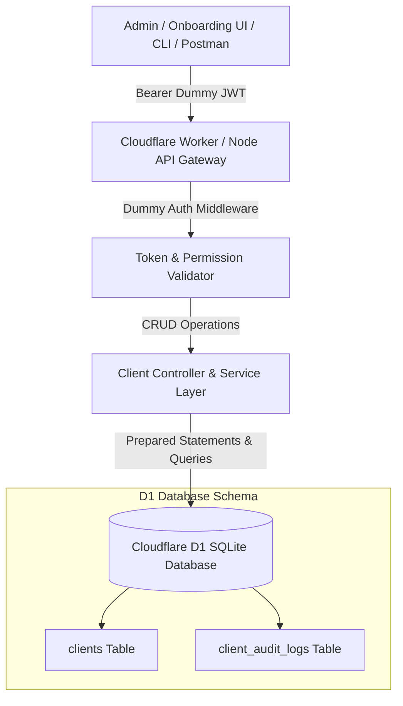

# Master Developer Task Roadmap & Architecture Specification
## Multi-Tenant Client Infrastructure & Automated Onboarding System (Cloudflare D1 SQLite)

---

## 🎯 Project Goal & Philosophy
> **Strict Guideline for Developer:** This document contains actionable, modular task units for implementing the centralized multi-tenant client infrastructure management system using **Cloudflare D1 (Serverless SQLite)** and a **RESTful CRUD API** secured with a dummy JWT token.

---

## 🏗️ 1. System Architecture Overview



---

## 📑 2. Developer Task Breakdown

### 🔹 Module 1: Cloudflare D1 Database Provisioning & Schema Migration
**Objective:** Setup Cloudflare D1 SQLite database and define indexed schemas for clients and audit logs.

- [ ] **Task 1.1: Database Initialization**
  - Install Wrangler CLI: `npm install -D wrangler`
  - Run database creation: `npx wrangler d1 create client-manager-db`
  - Bind the database in `wrangler.toml`:
    ```toml
    [[d1_databases]]
    binding = "DB"
    database_name = "client-manager-db"
    database_id = "<YOUR_D1_DATABASE_ID>"
    ```

- [ ] **Task 1.2: SQL Migration Script (`migrations/0001_init_clients_schema.sql`)**
  - Write SQL table definitions:
    ```sql
    -- Table: clients
    CREATE TABLE IF NOT EXISTS clients (
        id INTEGER PRIMARY KEY AUTOINCREMENT,
        client_id TEXT NOT NULL UNIQUE,          -- e.g. "05"
        client_key TEXT NOT NULL UNIQUE,         -- e.g. "surokkha"
        brand_name TEXT NOT NULL,                -- e.g. "Surokkha"
        status TEXT DEFAULT 'active' CHECK(status IN ('active', 'inactive', 'suspended')),
        
        -- Domain Details
        storefront_domain TEXT NOT NULL UNIQUE,  -- "surokkha.store"
        admin_domain TEXT NOT NULL UNIQUE,       -- "admin.surokkha.store"
        api_domain TEXT NOT NULL UNIQUE,         -- "api.surokkha.store"
        
        -- Email Configurations
        admin_email TEXT NOT NULL,               -- Personal/Owner email
        support_email TEXT NOT NULL,             -- "support@surokkha.store"
        forwarding_email TEXT,                   -- "plexivia@gmail.com"
        
        -- Server & VPS Infrastructure
        vps_ip TEXT NOT NULL,                    -- "14.128.14.223"
        vps_port INTEGER DEFAULT 22,
        vps_user TEXT DEFAULT 'root',
        server_ssh_key TEXT,                     -- VPS SSH Private/Public Key
        
        -- Git Repositories & Deploy Keys
        frontend_git_repo TEXT NOT NULL,         -- Git repository URL
        frontend_deploy_key TEXT,                -- SSH deploy key
        backend_git_repo TEXT,                   -- Backend repository URL
        backend_deploy_key TEXT,                 -- Backend deploy key
        deployment_path TEXT DEFAULT '/opt/clients', -- Target server deployment path
        
        -- Configuration & Policy JSON Payloads
        policies_json TEXT DEFAULT '{}',         -- Stock, Pricing, Members Policies
        features_json TEXT DEFAULT '{}',         -- Enabled UI Features
        stock_config_json TEXT DEFAULT '{}',     -- Stock thresholds and rules
        
        created_at DATETIME DEFAULT CURRENT_TIMESTAMP,
        updated_at DATETIME DEFAULT CURRENT_TIMESTAMP
    );

    -- Table: client_audit_logs
    CREATE TABLE IF NOT EXISTS client_audit_logs (
        id INTEGER PRIMARY KEY AUTOINCREMENT,
        client_key TEXT NOT NULL,
        action TEXT NOT NULL,
        actor TEXT DEFAULT 'SuperAdmin',
        details_json TEXT,
        created_at DATETIME DEFAULT CURRENT_TIMESTAMP
    );

    -- Indices for high performance
    CREATE INDEX IF NOT EXISTS idx_clients_key ON clients(client_key);
    CREATE INDEX IF NOT EXISTS idx_clients_storefront ON clients(storefront_domain);
    CREATE INDEX IF NOT EXISTS idx_clients_status ON clients(status);
    ```
  - Execute migration:
    - Local: `npx wrangler d1 execute client-manager-db --local --file=./migrations/0001_init_clients_schema.sql`
    - Remote: `npx wrangler d1 execute client-manager-db --remote --file=./migrations/0001_init_clients_schema.sql`

---

### 🔹 Module 2: Authentication & Security Middleware
**Objective:** Enforce token-based access control with dummy token validation for early-stage development and testing.

- [ ] **Task 2.1: Dummy Auth Middleware Logic**
  - Extract header: `Authorization: Bearer <TOKEN>`
  - Validate token against pre-configured dummy secret string (e.g. `CLOUDFLARE_D1_SUPER_DUMMY_2026`).
  - If valid: attach mock context `{ user: { role: 'SuperAdmin', isDummy: true } }` and proceed to handler.
  - If missing or mismatch: return `401 Unauthorized` with structured JSON error.

---

### 🔹 Module 3: Client Onboarding & Management CRUD API
**Objective:** Implement modular HTTP handlers to support full lifecycle client management.

- [ ] **Task 3.1: POST `/api/v1/clients/onboard` (Create Client)**
  - Validate required fields: `client_id`, `client_key`, `brand_name`, `storefront_domain`, `admin_domain`, `api_domain`, `admin_email`, `support_email`, `vps_ip`, `frontend_git_repo`.
  - Sanitize strings (`client_key` lowercase/slug, strip protocol from domains).
  - Verify uniqueness across `client_key`, `client_id`, and `storefront_domain`.
  - Serialize policy and feature payloads to JSON string (`policies_json`, `features_json`).
  - Execute parameterized `INSERT` query.
  - Insert record into `client_audit_logs` (`action: 'CLIENT_ONBOARDED'`).
  - Return `201 Created` with created client summary.

- [ ] **Task 3.2: GET `/api/v1/clients` (List All Clients)**
  - Support query parameters: `?status=active&page=1&limit=25&q=searchQuery`.
  - Execute paginated `SELECT` query returning sanitized summaries (exclude sensitive SSH private keys from list view).
  - Return `200 OK` with pagination metadata.

- [ ] **Task 3.3: GET `/api/v1/clients/:id_or_key` (Get Single Client Details)**
  - Support lookup by either numeric primary key `id` or string `client_key`.
  - Return complete infrastructure profile (including SSH/deploy keys and parsed JSON policies).
  - Return `404 Not Found` if client does not exist.

- [ ] **Task 3.4: PATCH `/api/v1/clients/:id` (Update Client Configuration)**
  - Allow updating specific fields: `brand_name`, `domains`, `emails`, `vps_ip`, `ssh_keys`, `git_repos`, `policies_json`, `features_json`.
  - Dynamically construct safe parameterized `UPDATE` statement.
  - Set `updated_at = CURRENT_TIMESTAMP`.
  - Log audit trail (`action: 'CLIENT_UPDATED'`).
  - Return `200 OK` with updated record.

- [ ] **Task 3.5: PATCH `/api/v1/clients/:id/status` (Toggle Status)**
  - Accept `{ "status": "active" | "inactive" | "suspended" }`.
  - Update status and record audit log.
  - Return `200 OK`.

- [ ] **Task 3.6: DELETE `/api/v1/clients/:id` (Archive / Delete Client)**
  - Execute deletion or soft-delete (status = 'suspended' / 'archived').
  - Record audit log.
  - Return `200 OK`.

---

## 🧪 3. Quality Assurance & Developer Testing Checklist

- [ ] **Test Case 1: Onboarding Success Flow**
  - Send complete mock payload with valid dummy bearer token.
  - Verify `201 Created` status code and verify data exists in D1.
- [ ] **Test Case 2: Duplicate Prevention**
  - Re-send onboarding payload with identical `client_key` or `storefront_domain`.
  - Verify system returns `409 Conflict` or descriptive `400 Bad Request`.
- [ ] **Test Case 3: Authentication Gatekeeping**
  - Send request without `Authorization` header -> Verify `401 Unauthorized`.
  - Send request with wrong token -> Verify `401 Unauthorized`.
- [ ] **Test Case 4: JSON Policy Handling**
  - Send nested JavaScript objects for `policies` and `features`.
  - Verify proper serialization on write and deserialization on read.
- [ ] **Test Case 5: Audit Logging**
  - Confirm that every write operation (`onboard`, `update`, `status change`, `delete`) inserts a corresponding record in `client_audit_logs`.

---

## 🚀 4. Deliverables Expected from Developer
1. `schema.sql` / Migration files for D1.
2. API Router & Controller handlers with parameterized SQL queries.
3. Dummy JWT authentication middleware.
4. Postman / Bruno / cURL collection for API verification.
