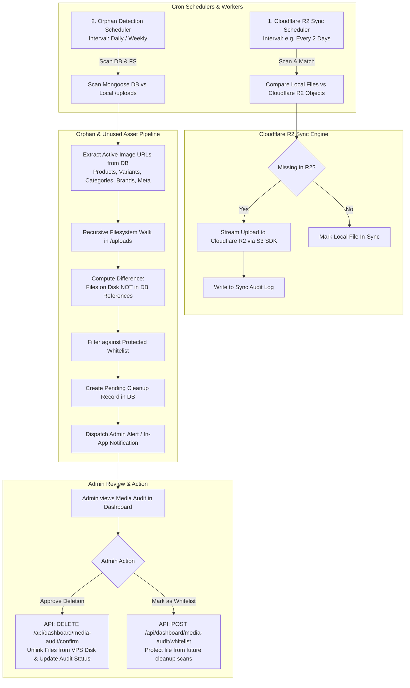

# Cloudflare R2 Sync & Orphan Image Cleanup Architecture (`10_Cloudflare_R2_Sync_and_Orphan_Cleanup.md`)

This guide details the complete architecture, background scheduler, Cloudflare R2 bucket synchronization, unused/orphan asset detection engine, and admin confirmation & approval workflow for the white-label e-commerce system.

---

## 1. Overview & Objectives

In our multi-tenant white-label deployment (Decantre, Engulfic, Toyoland, etc.), image assets are stored locally on each VPS at `/var/www/uploads` (mapped to backend container `/uploads`).

### Core Objectives:
1. **Cloudflare R2 Synchronizer**: An automated S3-compatible sync engine that periodically (default: every **2 days**, configurable) checks local VPS storage against the Cloudflare R2 bucket and uploads any missing assets to ensure off-site high-availability backup and CDN readiness.
2. **Orphan & Unused Media Identification Engine**: A periodic scheduler that cross-references all physical media files in `/uploads` against active MongoDB documents (Products, Variants, Categories, Brands, Meta, and Site Configs).
3. **Safe Admin Notification & Review Notice**: Identified unused files are never hard-deleted automatically. Instead, an audit notice (`MediaCleanupAudit`) is recorded and an alert is sent to the Admin Dashboard.
4. **Admin Approval & Cleanup API**: Admins can preview images, whitelist protected files, and approve permanent disk deletion.

---

## 2. System Architecture Flow



---

## 3. Cloudflare R2 Sync Engine Specification

### A. Prerequisites & SDK
Using `@aws-sdk/client-s3` with Cloudflare R2's S3-compatible endpoint:

```text
Endpoint: https://<ACCOUNT_ID>.r2.cloudflarestorage.com
Region: "auto"
Credentials: R2_ACCESS_KEY_ID & R2_SECRET_ACCESS_KEY
```

### B. Environment Configuration Variables (`.env`)
```ini
# Cloudflare R2 Configuration
R2_ACCOUNT_ID=your_cloudflare_account_id
R2_ACCESS_KEY_ID=your_r2_access_key_id
R2_SECRET_ACCESS_KEY=your_r2_secret_access_key
R2_BUCKET_NAME=decantre-media-backup
R2_PUBLIC_URL=https://media.decantrebd.com
R2_SYNC_INTERVAL_DAYS=2
R2_SYNC_ENABLED=true
```

### C. Execution Algorithm
1. **Local Filesystem Inventory**: Recursively collect relative paths (`2608/260813/filename.webp`) and file sizes/hashes.
2. **R2 Remote Inventory**: Execute `ListObjectsV2Command` (with pagination `ContinuationToken`) to fetch all object keys under the client prefix.
3. **Difference Calculation**:
   $$\text{SyncQueue} = \text{LocalFiles} \setminus \text{R2RemoteKeys}$$
4. **Batch Stream Upload**: Upload missing files in parallel with controlled concurrency (e.g., 5 parallel streams) and attach appropriate `ContentType` headers.

---

## 4. Orphan & Unused Media Identification Engine

### A. Database Media Reference Collectors
The scanner queries MongoDB collections to construct an exhaustive Set of active URLs:
* **`ProductModel`**:
  - `imageUrl`
  - `thumbnailUrl`
  - `images[]` (Gallery images)
  - `variants[].imageUrl`
  - `metaData.ogImage`
* **`CategoryModel`**:
  - `imageUrl`, `iconUrl`
* **`BrandModel`**:
  - `imageUrl`, `logoUrl`
* **`StoreConfig` / `Settings`**:
  - `logoUrl`, `faviconUrl`, `bannerImages[]`

### B. Protected Assets Whitelist
Certain system files must never be flagged as orphans:
- `/uploads/product_placeholder.webp`
- Default avatars, system icons, and SVG placeholders
- Files matching `isWhitelisted: true` in `MediaCleanupAudit` collection

### C. Mongoose Audit Schema (`MediaCleanupAudit`)
```javascript
const mediaCleanupAuditSchema = new Schema({
  filePath: { type: String, required: true, unique: true }, // e.g. "/uploads/2608/260813/orphan.webp"
  filename: { type: String, required: true },
  fileSize: { type: Number, required: true }, // in bytes
  detectedAt: { type: Date, default: Date.now },
  status: {
    type: String,
    enum: ["PENDING_REVIEW", "WHITELISTED", "DELETED", "IGNORED"],
    default: "PENDING_REVIEW",
    index: true,
  },
  reviewedBy: { type: Schema.Types.ObjectId, ref: "User", default: null },
  reviewedAt: { type: Date, default: null },
});
```

---

## 5. API Endpoints for Dashboard Integration

All endpoints are protected and placed under `backend/src/dashboard/routes/mediaAuditRoute.js` (Role: `Owner`, `Admin`):

| Method | Endpoint | Description |
| :--- | :--- | :--- |
| `GET` | `/api/dashboard/media-audit/summary` | Returns storage stats, total local files, R2 sync status, and orphan count. |
| `GET` | `/api/dashboard/media-audit/orphans` | Returns paginated list of pending orphan images with thumbnails & sizes. |
| `POST` | `/api/dashboard/media-audit/scan` | Manually triggers the DB vs filesystem orphan scan. |
| `POST` | `/api/dashboard/media-audit/r2-sync` | Manually triggers the Cloudflare R2 sync pipeline. |
| `POST` | `/api/dashboard/media-audit/whitelist` | Marks specified file IDs as whitelisted (never to be deleted). |
| `DELETE` | `/api/dashboard/media-audit/confirm` | Deletes selected or all approved orphan files from VPS disk storage. |

---

## 6. Admin Dashboard UI Specifications

* **Route**: `/dashboard/settings/media-audit` or `/dashboard/media-cleanup`
* **UI Features**:
  1. **Top Metric Cards**:
     - 📦 Total Local Media Size (e.g. `1.84 GB`)
     - ☁️ Cloudflare R2 Sync Status (`100% In-Sync` or `12 files pending`)
     - 🗑️ Unused / Orphan Assets (`45 files (~320 MB reclaimable)`)
  2. **R2 Sync Controller**: Button to "Run R2 Sync Now" and a dropdown to adjust sync frequency ($1, 2, 7$ days).
  3. **Orphan Review Table**:
     - Image Thumbnail & Filename preview
     - File size & Creation Date
     - Checkbox selection for Batch Actions: `Delete Selected`, `Whitelist Selected`, `Select All`.

---

## 7. Implementation Checklist

- [ ] **Step 1**: Install AWS S3 SDK in backend (`@aws-sdk/client-s3`).
- [ ] **Step 2**: Create R2 Client helper (`backend/src/config/r2.config.js`).
- [ ] **Step 3**: Create Mongoose schemas `mediaAudit.model.js` and `syncLog.model.js`.
- [ ] **Step 4**: Implement `r2Sync.service.js` with differential upload logic.
- [ ] **Step 5**: Implement `mediaAudit.service.js` for DB reference aggregation & filesystem diffing.
- [ ] **Step 6**: Setup Cron / Scheduler triggers in backend server lifecycle.
- [ ] **Step 7**: Implement Controller & Routes in `backend/src/dashboard/`.
- [ ] **Step 8**: Build Next.js Dashboard Media Audit management screen.
- [ ] **Step 9**: Validate end-to-end flow with sample orphan files.
