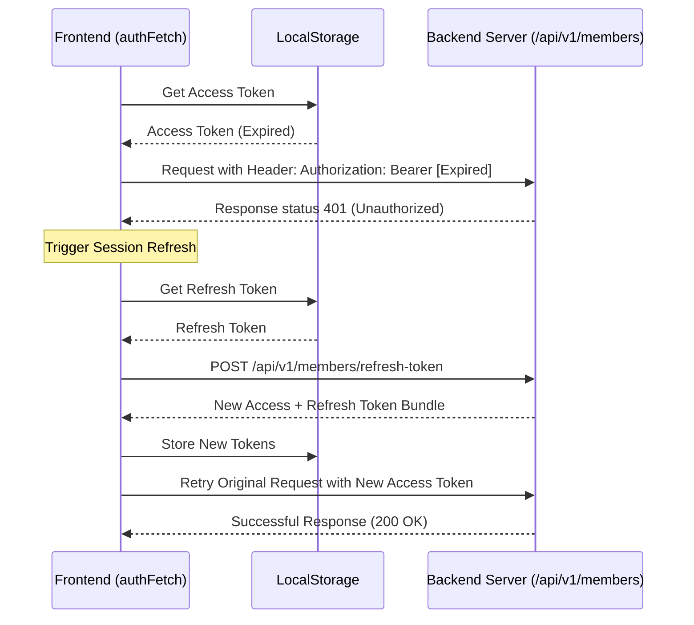
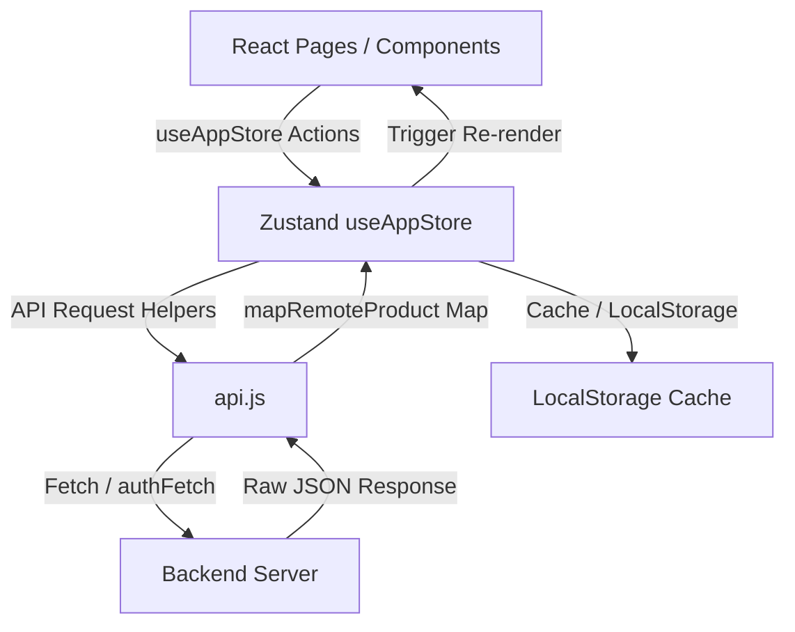

# Decantre Frontend API Integration & State Flow Documentation (Version 2)

This document provides a comprehensive and exhaustive guide to how API communication, authentication flows, data mapping, state management, and page/component-level implementations are structured in the Decantre frontend.

---

## 1. Core API Configuration & Architecture

All API calls are centralized in [`frontend/src/core/lib/api.js`](file:///c:/Users/mdikr/Documents/CODE/Decantre_Fullstack/frontend/src/core/lib/api.js). The module uses environment variables to resolve backend URLs, manages tokens in `localStorage`, and provides robust fetching wrappers with timeout and retry mechanisms.

### Environment URL Resolution
API URLs are resolved dynamically with sanitization (removing trailing slashes):
- **API Base URL (`getApiBaseUrl`)**: Resolves `import.meta.env.VITE_API_URL` or `import.meta.env.NEXT_PUBLIC_API_URL` (fallback to empty string).
- **Image Base URL (`getImageBaseUrl`)**: Resolves `import.meta.env.VITE_IMAGE_BASE_URL` or fallback to `getApiBaseUrl()`.

```javascript
export const getApiBaseUrl = () => {
  const envUrl = import.meta.env.VITE_API_URL || import.meta.env.NEXT_PUBLIC_API_URL || "";
  return envUrl ? envUrl.replace(/\/$/, "") : "";
};

export const getImageBaseUrl = () => {
  const envImgUrl = import.meta.env.VITE_IMAGE_BASE_URL || import.meta.env.NEXT_PUBLIC_IMAGE_BASE_URL || "";
  return envImgUrl ? envImgUrl.replace(/\/$/, "") : getApiBaseUrl();
};
```

---

## 2. Request Handling Utilities & Retries

To handle network fluctuations, the application implements timeouts and automatic retries.

### fetchWithTimeout & fetchWithRetry
- **Timeout**: Enforces a maximum response wait time (default: `10000ms`) using `AbortController`.
- **Retry**: Retries failing network requests up to `maxAttempts` (default: 3) with an incremental backoff delay (`250ms * attempt`).

```javascript
const fetchWithTimeout = async (url, options = {}, timeout = 10000) => {
  const controller = new AbortController();
  const id = setTimeout(() => controller.abort(), timeout);
  try {
    const response = await fetch(url, { ...options, signal: controller.signal });
    clearTimeout(id);
    return response;
  } catch (err) {
    clearTimeout(id);
    throw err;
  }
};

const fetchWithRetry = async (url, options = {}, timeout = 10000, maxAttempts = 3, attempt = 1) => {
  try {
    return await fetchWithTimeout(url, options, timeout);
  } catch (err) {
    if (attempt >= maxAttempts) throw err;
    await delay(250 * attempt);
    return fetchWithRetry(url, options, timeout, maxAttempts, attempt + 1);
  }
};
```

---

## 3. Authentication & Token Lifecycle Flow

Decantre uses JWT-based authentication. Client tokens are stored securely in `localStorage`:
- Access Token Key: `luxury_access_token`
- Refresh Token Key: `luxury_refresh_token`



### Authorization Fetch Wrapper (`authFetch`)
Any authorized route uses `authFetch`, which automatically:
1. Attaches the `Authorization: Bearer <token>` header.
2. Formats requests as `application/json` (excluding `FormData`).
3. Intercepts `401 Unauthorized` responses, refreshes the token using `refreshMemberSession()`, updates local storage, and retries the original request.

```javascript
export const authFetch = async (url, options = {}, timeout = 10000) => {
  const { accessToken } = getStoredMemberTokens();
  const headers = new Headers(options.headers || {});

  if (accessToken) {
    headers.set("Authorization", `Bearer ${accessToken}`);
  }

  if (options.body && !(options.body instanceof FormData) && !headers.has("Content-Type")) {
    headers.set("Content-Type", "application/json");
  }

  let res = await fetchWithRetry(url, { ...options, headers }, timeout, 3);

  if (res.status === 401) {
    try {
      const refreshed = await refreshMemberSession();
      const retryHeaders = new Headers(options.headers || {});
      retryHeaders.set("Authorization", `Bearer ${refreshed.accessToken}`);
      
      if (options.body && !(options.body instanceof FormData) && !retryHeaders.has("Content-Type")) {
        retryHeaders.set("Content-Type", "application/json");
      }

      res = await fetchWithRetry(url, { ...options, headers: retryHeaders }, timeout, 3);
    } catch (_) {
      clearStoredMemberTokens();
      throw new Error("Your session has expired. Please log in again.");
    }
  }
  return res;
};
```

---

## 4. Complete API Endpoint Dictionary

Here is the integration code and store lifecycle details for **every single** API endpoint in the application.

### 4.1 Products API

#### 1. Fetch Products List (`fetchProducts`)
- **Endpoint**: `GET /api/v1/products`
- **Query Params**: `skip`, `limit`, `sortBy`, `order`, `q` (search), `category`, `brand`, `season`, `tags`, `filter`, `name`, `slug`, `did`, `min_price`, `max_price`
- **Flow**: Fetches remote products, normalizes them via `mapRemoteProduct`, and injects custom metadata.
- **Store Integration**: In `useAppStore`, `fetchProducts` manages loading/error states and sets the global `products` array.

```javascript
// api.js Integration
export async function fetchProducts(opts = {}) {
  const apiBaseUrl = getApiBaseUrl();
  const skip = opts.skip ?? opts.offset ?? 0;
  const limit = Math.min(opts.limit || 20, 100);
  const sortBy = opts.sortBy || "createdAt";
  const order = opts.order || "desc";
  const q = opts.q || opts.search || opts.keyword || "";

  const params = new URLSearchParams();
  if (q) params.set("q", q);
  if (opts.category) params.set("category", opts.category);
  if (opts.brand) params.set("brand", opts.brand);
  if (opts.season) params.set("season", opts.season);
  if (opts.tags) params.set("tags", opts.tags);
  if (opts.filter) params.set("filter", opts.filter);
  if (opts.name) params.set("name", opts.name);
  if (opts.slug) params.set("slug", opts.slug);
  if (opts.did) params.set("did", opts.did);
  if (opts.minPrice !== undefined) params.set("min_price", opts.minPrice);
  if (opts.maxPrice !== undefined) params.set("max_price", opts.maxPrice);

  params.set("skip", String(skip));
  params.set("limit", String(limit));
  params.set("sortBy", sortBy);
  params.set("order", order);

  try {
    const res = await fetchWithRetry(`${apiBaseUrl}/api/v1/products?${params.toString()}`, { method: "GET" }, 10000, 3);
    if (!res.ok) throw new Error(`Server error: ${res.status}`);
    
    const json = await res.json();
    const list = Array.isArray(json.data) ? json.data : Array.isArray(json) ? json : [];
    const mapped = list.map(mapRemoteProduct);
    mapped._meta = json.meta || null;
    mapped._totalRows = json.meta?.total_products ?? json.totalRows ?? list.length;
    return mapped;
  } catch (err) {
    console.error("fetchProducts Error:", err);
    throw err;
  }
}
```
**Zustand Handler:**
```javascript
fetchProducts: async (opts = {}) => {
  set({ isProductsLoading: true, productsError: null });
  try {
    const mapped = await apiFetchProducts(opts);
    set({ products: mapped, isProductsLoading: false });
    return mapped;
  } catch (err) {
    set({ isProductsLoading: false, productsError: 'Something went wrong' });
    return [];
  }
}
```

#### 2. Fetch Product Details (`fetchProductDetails`)
- **Endpoint**: `GET /api/v1/products/:slugOrId` with fallback to `GET /api/wp/products/:slugOrId`
- **Flow**: Tries querying the direct API. If it returns non-OK (e.g. legacy WP item), falls back to WordPress-proxied endpoint. Normalizes output via `mapRemoteProduct`.
- **Store Integration**: Bound directly under `useAppStore.fetchProductDetails`.

```javascript
// api.js Integration
export async function fetchProductDetails(slugOrId) {
  const apiBaseUrl = getApiBaseUrl();
  try {
    let res = await fetchWithRetry(`${apiBaseUrl}/api/v1/products/${slugOrId}`, {}, 8000, 3);
    if (!res.ok) {
      res = await fetchWithRetry(`${apiBaseUrl}/api/wp/products/${slugOrId}`, {}, 8000, 3);
    }
    if (!res.ok) throw new Error("Failed to fetch product details.");
    
    const json = await res.json();
    const targetData = json.data || json;
    return targetData && typeof targetData === "object" ? mapRemoteProduct(targetData) : null;
  } catch (err) {
    console.error("fetchProductDetails Error:", err);
    throw err;
  }
}
```

#### 3. Fetch Combo / Bundle Products (`fetchCombos`)
- **Endpoint**: Leverages `fetchProducts` sequentially with categories: `Combo`, `Bundle`, `Combo Set`.
- **Store Integration**: In `useAppStore`, updates `combos` array and handles `isCombosLoading`.

```javascript
// api.js Integration
export async function fetchCombos(opts = {}) {
  const limit = opts.limit || 100;
  const categoryNames = ["Combo", "Bundle", "Combo Set"];
  for (const cat of categoryNames) {
    try {
      const results = await fetchProducts({ category: cat, skip: 0, limit });
      if (results && results.length > 0) return results;
    } catch (_) {}
  }
  return [];
}
```

---

### 4.2 Categories & Brands API

#### 1. Fetch Categories (`fetchCategories`)
- **Endpoint**: `GET /api/v1/categories`
- **Store Integration**: Populates `categories` and caches the JSON array inside `localStorage` (`luxury_categories`) for instant load on refresh.

```javascript
// api.js Integration
export async function fetchCategories(opts = {}) {
  const apiBaseUrl = getApiBaseUrl();
  const skip = opts.skip ?? 0;
  const limit = opts.limit || 50;
  try {
    const res = await fetchWithRetry(`${apiBaseUrl}/api/v1/categories?skip=${skip}&limit=${limit}`, {}, 8000, 3);
    if (!res.ok) throw new Error("Failed to fetch categories.");
    const json = await res.json();
    return Array.isArray(json.data) ? json.data : Array.isArray(json) ? json : [];
  } catch (err) {
    console.error("fetchCategories Error:", err);
    throw err;
  }
}
```

#### 2. Fetch Brands (`fetchBrands`)
- **Endpoint**: `GET /api/v1/brands`
- **Store Integration**: Populates `brands` and caches the JSON array inside `localStorage` (`luxury_brands`).

```javascript
// api.js Integration
export async function fetchBrands(opts = {}) {
  const apiBaseUrl = getApiBaseUrl();
  const skip = opts.skip ?? 0;
  const limit = opts.limit || 50;
  try {
    const res = await fetchWithRetry(`${apiBaseUrl}/api/v1/brands?skip=${skip}&limit=${limit}`, {}, 8000, 3);
    if (!res.ok) throw new Error("Failed to fetch brands.");
    const json = await res.json();
    return Array.isArray(json.data) ? json.data : Array.isArray(json) ? json : [];
  } catch (err) {
    console.error("fetchBrands Error:", err);
    throw err;
  }
}
```

---

### 4.3 Coupons & Orders API

#### 1. Fetch Coupon By Code (`fetchCouponByCode`)
- **Endpoint**: `GET /api/v1/coupons/:code`
- **Store Integration**: Handled under `applyPromoCode`. Validates status, minimum purchase constraints, and date validity.

```javascript
// api.js Integration
export async function fetchCouponByCode(code) {
  const apiBaseUrl = getApiBaseUrl();
  const res = await fetchWithRetry(`${apiBaseUrl}/api/v1/coupons/${encodeURIComponent(code)}`, {
    method: "GET",
    headers: { "Content-Type": "application/json" },
  });
  const json = await res.json().catch(() => null);
  if (!res.ok) throw new Error(json?.message || json?.error || "Invalid coupon code.");
  return json?.data || json;
}
```

#### 2. Create Order (`createOrder`)
- **Endpoint**: `POST /api/v1/orders/new-order`
- **Payload**: Full shipping detail, payment credentials (BKash/Nagad/Bank details), items array, and subtotal/shipping fees.
- **Store Integration**: Dispatched during Checkout Submission. Clears the cart on success and triggers the "Order Completed" screens.

```javascript
// api.js Integration
export async function createOrder(orderPayload) {
  const apiBaseUrl = getApiBaseUrl();
  const res = await fetch(`${apiBaseUrl}/api/v1/orders/new-order`, {
    method: "POST",
    headers: { "Content-Type": "application/json" },
    body: JSON.stringify(orderPayload),
  });
  const json = await res.json().catch(() => null);
  if (!res.ok) {
    const errorMsg = json?.errors?.join(", ") || json?.message || "Failed to place order";
    throw new Error(errorMsg);
  }
  return json;
}
```

---

### 4.4 Member Authentication API

#### 1. Check Member Email (`checkMemberEmail`)
- **Endpoint**: `POST /api/v1/members/check-email`

```javascript
export async function checkMemberEmail(emailPayload) {
  const apiBaseUrl = getApiBaseUrl();
  const res = await fetch(`${apiBaseUrl}/api/v1/members/check-email`, {
    method: "POST",
    headers: { "Content-Type": "application/json" },
    body: JSON.stringify(emailPayload),
  });
  const json = await res.json().catch(() => null);
  if (!res.ok) throw new Error(json?.message || "Email check failed.");
  return json;
}
```

#### 2. Member Login (`loginMember`)
- **Endpoint**: `POST /api/v1/members/login`

```javascript
export async function loginMember(credentials) {
  const apiBaseUrl = getApiBaseUrl();
  const res = await fetch(`${apiBaseUrl}/api/v1/members/login`, {
    method: "POST",
    headers: { "Content-Type": "application/json" },
    body: JSON.stringify(credentials),
  });
  const json = await res.json().catch(() => null);
  if (!res.ok) throw new Error(json?.message || "Login failed.");
  return json;
}
```

#### 3. Register Member (`registerMember`)
- **Endpoint**: `POST /api/v1/members/register`

```javascript
export async function registerMember(memberPayload) {
  const apiBaseUrl = getApiBaseUrl();
  const res = await fetch(`${apiBaseUrl}/api/v1/members/register`, {
    method: "POST",
    headers: { "Content-Type": "application/json" },
    body: JSON.stringify(memberPayload),
  });
  const json = await res.json().catch(() => null);
  if (!res.ok) throw new Error(json?.message || "Registration failed.");
  return json;
}
```

#### 4. Verify Member OTP (`verifyMemberOtp`)
- **Endpoint**: `POST /api/v1/members/verify-otp`

```javascript
export async function verifyMemberOtp(payload) {
  const apiBaseUrl = getApiBaseUrl();
  const res = await fetch(`${apiBaseUrl}/api/v1/members/verify-otp`, {
    method: "POST",
    headers: { "Content-Type": "application/json" },
    body: JSON.stringify(payload),
  });
  const json = await res.json().catch(() => null);
  if (!res.ok) throw new Error(json?.message || "OTP verification failed.");
  return json;
}
```

#### 5. Resend Member OTP (`resendMemberOtp`)
- **Endpoint**: `POST /api/v1/members/resend-otp`

```javascript
export async function resendMemberOtp(payload) {
  const apiBaseUrl = getApiBaseUrl();
  const res = await fetch(`${apiBaseUrl}/api/v1/members/resend-otp`, {
    method: "POST",
    headers: { "Content-Type": "application/json" },
    body: JSON.stringify(payload),
  });
  const json = await res.json().catch(() => null);
  if (!res.ok) throw new Error(json?.message || "Failed to resend OTP.");
  return json;
}
```

#### 6. Forgot Member Password (`forgotMemberPassword`)
- **Endpoint**: `POST /api/v1/members/forgot-password`

```javascript
export async function forgotMemberPassword(payload) {
  const apiBaseUrl = getApiBaseUrl();
  const res = await fetch(`${apiBaseUrl}/api/v1/members/forgot-password`, {
    method: "POST",
    headers: { "Content-Type": "application/json" },
    body: JSON.stringify(payload),
  });
  const json = await res.json().catch(() => null);
  if (!res.ok) throw new Error(json?.message || "Password reset request failed.");
  return json;
}
```

#### 7. Reset Member Password (`resetMemberPassword`)
- **Endpoint**: `POST /api/v1/members/reset-password`

```javascript
export async function resetMemberPassword(payload) {
  const apiBaseUrl = getApiBaseUrl();
  const res = await fetch(`${apiBaseUrl}/api/v1/members/reset-password`, {
    method: "POST",
    headers: { "Content-Type": "application/json" },
    body: JSON.stringify(payload),
  });
  const json = await res.json().catch(() => null);
  if (!res.ok) throw new Error(json?.message || "Password reset failed.");
  return json;
}
```

#### 8. Refresh Member Access Token (`refreshMemberToken`)
- **Endpoint**: `POST /api/v1/members/refresh-token`

```javascript
export async function refreshMemberToken(payload) {
  const apiBaseUrl = getApiBaseUrl();
  const res = await fetch(`${apiBaseUrl}/api/v1/members/refresh-token`, {
    method: "POST",
    headers: { "Content-Type": "application/json" },
    body: JSON.stringify(payload),
  });
  const json = await res.json().catch(() => null);
  if (!res.ok) throw new Error(json?.message || "Token refresh failed.");
  return json;
}
```

#### 9. Logout Member Session (`logoutMember`)
- **Endpoint**: `POST /api/v1/members/logout`

```javascript
export async function logoutMember(payload) {
  const apiBaseUrl = getApiBaseUrl();
  const res = await fetch(`${apiBaseUrl}/api/v1/members/logout`, {
    method: "POST",
    headers: { "Content-Type": "application/json" },
    body: JSON.stringify(payload),
  });
  const json = await res.json().catch(() => null);
  if (!res.ok) throw new Error(json?.message || "Logout failed.");
  return json;
}
```

---

### 4.5 Members Administration API (Protected)

#### 1. Fetch Members List (`fetchMembers`)
- **Endpoint**: `GET /api/v1/members`

```javascript
export async function fetchMembers() {
  const apiBaseUrl = getApiBaseUrl();
  const res = await authFetch(`${apiBaseUrl}/api/v1/members`, {
    method: "GET",
    headers: { "Content-Type": "application/json" },
  });
  const json = await res.json().catch(() => null);
  if (!res.ok) throw new Error(json?.message || "Failed to fetch members list.");
  return json?.data || [];
}
```

#### 2. Fetch Member By ID (`fetchMemberById`)
- **Endpoint**: `GET /api/v1/members/:memberId`

```javascript
export async function fetchMemberById(memberId) {
  const apiBaseUrl = getApiBaseUrl();
  const res = await authFetch(`${apiBaseUrl}/api/v1/members/${memberId}`, {
    method: "GET",
    headers: { "Content-Type": "application/json" },
  });
  const json = await res.json().catch(() => null);
  if (!res.ok) throw new Error(json?.message || "Member not found.");
  return json?.data || json;
}
```

#### 3. Create Member (`createMember`)
- **Endpoint**: `POST /api/v1/members`

```javascript
export async function createMember(memberPayload) {
  const apiBaseUrl = getApiBaseUrl();
  const res = await authFetch(`${apiBaseUrl}/api/v1/members`, {
    method: "POST",
    headers: { "Content-Type": "application/json" },
    body: JSON.stringify(memberPayload),
  });
  const json = await res.json().catch(() => null);
  if (!res.ok) throw new Error(json?.message || "Failed to create member.");
  return json?.data || json;
}
```

#### 4. Update Member (`updateMember`)
- **Endpoint**: `PUT /api/v1/members/:memberId`

```javascript
export async function updateMember(memberId, updatePayload) {
  const apiBaseUrl = getApiBaseUrl();
  const res = await authFetch(`${apiBaseUrl}/api/v1/members/${memberId}`, {
    method: "PUT",
    headers: { "Content-Type": "application/json" },
    body: JSON.stringify(updatePayload),
  });
  const json = await res.json().catch(() => null);
  if (!res.ok) throw new Error(json?.message || "Failed to update member.");
  return json?.data || json;
}
```

#### 5. Delete Member (`deleteMember`)
- **Endpoint**: `DELETE /api/v1/members/:memberId`

```javascript
export async function deleteMember(memberId) {
  const apiBaseUrl = getApiBaseUrl();
  const res = await authFetch(`${apiBaseUrl}/api/v1/members/${memberId}`, {
    method: "DELETE",
    headers: { "Content-Type": "application/json" },
  });
  const json = await res.json().catch(() => null);
  if (!res.ok) throw new Error(json?.message || "Failed to delete member.");
  return json;
}
```

---

## 5. Page & Component Level Integration (Where & How APIs are Called)

Below are detailed, page-specific integrations showing exactly where endpoints and handlers from `api.js` or `useAppStore` are invoked.

### 5.1 Authentication Flow - `AuthModal.jsx`
Located in [`frontend/src/components/AuthModal.jsx`](file:///c:/Users/mdikr/Documents/CODE/Decantre_Fullstack/frontend/src/components/AuthModal.jsx). Imports direct helpers from `api.js` to drive the member signup, login, OTP dispatching, and password reset procedures.

* **Email Validity & State Routing (Check Email)**:
  Uses `checkMemberEmail` to decide if the member profile is already verified or needs OTP checks.
  ```javascript
  const response = await checkMemberEmail({ email });
  if (response.requiresOtp || response.isEmailVerified === false) {
    setOtpContext('login');
    setMode('otp');
    setResendTimer(180);
    return;
  }
  setLoginStep(2); // verified, proceed to password submission
  ```
* **Credential Submission (Login)**:
  Uses `loginMember`. Intercepts OTP prompts or issues access tokens.
  ```javascript
  const response = await loginMember({ email, password });
  if (response.requiresOtp || response.isEmailVerified === false) {
    setOtpContext('login');
    setMode('otp');
    return;
  }
  setUser(loggedInUser, { accessToken, refreshToken });
  ```
* **Profile Creation (Register)**:
  Uses `registerMember` to create user profiles and trigger first-time OTP verifications.
  ```javascript
  const response = await registerMember({ name, email, phone: `+880${phone}`, password });
  setOtpContext('register');
  setMode('otp');
  ```
* **Two-Factor/OTP Verification (`verifyMemberOtp` & `resendMemberOtp`)**:
  Performs OTP verification for register or login flows.
  ```javascript
  const response = await verifyMemberOtp({ email, otp: code, context: otpContext });
  // If verifying password forgot flow, transition mode
  if (otpContext === 'forgot') {
    setMode('reset');
    return;
  }
  setUser(verifiedUser, { accessToken, refreshToken });
  ```

---

### 5.2 Real-time Product Query Dropdown - `SearchDropdown.jsx`
Located in [`frontend/src/components/SearchDropdown.jsx`](file:///c:/Users/mdikr/Documents/CODE/Decantre_Fullstack/frontend/src/components/SearchDropdown.jsx). Utilizes `fetchProducts` from `api.js` directly with a custom query parameter payload and debounce interval of `300ms`.

```javascript
useEffect(() => {
  if (!query || String(query).trim().length === 0) return;
  const q = String(query).trim();
  
  const timer = setTimeout(async () => {
    try {
      const items = await fetchProducts({ q, limit: maxResults });
      setResults(items.slice(0, maxResults));
    } catch (err) {
      setError('Failed to load results');
    }
  }, 300);
  
  return () => clearTimeout(timer);
}, [query, maxResults]);
```

---

### 5.3 Catalog Store-binding & URL sync - `Shop.jsx` & `SearchResults.jsx`
Located in [`frontend/src/pages/Shop.jsx`](file:///c:/Users/mdikr/Documents/CODE/Decantre_Fullstack/frontend/src/pages/Shop.jsx) and [`frontend/src/pages/SearchResults.jsx`](file:///c:/Users/mdikr/Documents/CODE/Decantre_Fullstack/frontend/src/pages/SearchResults.jsx).
These pages destructure actions from `useApp()` which calls the store methods:
- Syncs URL parameters (e.g. `?category=`, `?brand=`, `?search=`, `?minPrice=`) into React state using `useSearchParams`.
- Calls `loadProductsPage` on mount or query updates.
- Executes `fetchProducts` via Zustand, mapping the retrieved arrays directly onto states, resolving total page count dynamically.

```javascript
const loadProductsPage = async (targetPage = 1) => {
  const opts = {
    skip: (targetPage - 1) * pageSize,
    limit: pageSize,
    sortBy,
    order,
  };
  if (selectedCategory && selectedCategory !== 'All') opts.category = categoryVal;
  if (brandFilters.length > 0) opts.brand = resolvedBrands.join(',');
  if (searchQuery) opts.q = searchQuery;

  setIsLoadingProducts(true);
  try {
    const result = await fetchProducts(opts);
    const nextProducts = Array.isArray(result) ? result.filter(p => p && p.id) : [];
    const totalRows = result._totalRows ?? nextProducts.length;
    setAllProducts(nextProducts);
    setTotalProducts(totalRows);
    setTotalPages(Math.max(1, Math.ceil(totalRows / pageSize)));
    setPage(targetPage);
  } finally {
    setIsLoadingProducts(false);
  }
};
```

---

### 5.4 Account Settings & Profiles Updates - `MyAccount.jsx`
Located in [`frontend/src/pages/MyAccount.jsx`](file:///c:/Users/mdikr/Documents/CODE/Decantre_Fullstack/frontend/src/pages/MyAccount.jsx). Updates member data using `updateMember` directly from `api.js`.

Updates nested schema elements like `billingInfo` and `shippingInfo` along with the user's base attributes, then updates local state and cache via `setUser`.

```javascript
const handleUpdateProfile = async (e) => {
  e.preventDefault();
  setIsUpdating(true);
  try {
    const billingInfo = { firstName, lastName, address1: billingAddress, city: billingCity, postcode: billingZip, phone: billingPhone };
    const shippingInfo = { firstName, lastName, address1: shippingAddress, city: shippingCity, postcode: shippingZip, phone: shippingPhone };
    
    const updatedUser = await updateMember(user.id || user._id, {
      name: name.trim(),
      phone: phone.trim(),
      billingInfo,
      shippingInfo
    });

    setUser({
      ...user,
      name: updatedUser.name || user.name,
      phone: updatedUser.phone || user.phone,
      raw: { ...user.raw, ...updatedUser }
    });
  } catch (err) {
    addToast('Update failed', 'error');
  } finally {
    setIsUpdating(false);
  }
};
```

---

### 5.5 Checkout Submission & Order Placements - `Checkout.jsx`
Located in [`frontend/src/pages/Checkout.jsx`](file:///c:/Users/mdikr/Documents/CODE/Decantre_Fullstack/frontend/src/pages/Checkout.jsx).
Instead of calling endpoints directly, the checkout page maps actions and variables from `useApp()` which wraps Zustand methods in [`useAppStore.js`](file:///c:/Users/mdikr/Documents/CODE/Decantre_Fullstack/frontend/src/core/store/useAppStore.js).

* **Coupon Promotion Checking (`applyPromoCode` / `removePromoCode`)**:
  Triggers a look-up inside `useAppStore` when promo button is clicked. Calls `fetchCouponByCode` and calculates discounts on the subtotal.
* **Order Creation (`handleCheckoutSubmit`)**:
  Validates delivery inputs, matches cod/bKash/Nagad transactional details, and dispatches the payload via `apiCreateOrder`.

---

### 5.6 Deep Details Load - `ProductDetail.jsx`
Located in [`frontend/src/pages/ProductDetail.jsx`](file:///c:/Users/mdikr/Documents/CODE/Decantre_Fullstack/frontend/src/pages/ProductDetail.jsx). Implements a double-tier fallback resolving mechanism.

```javascript
const loadProductDetail = async () => {
  setIsLoading(true);
  try {
    // Tier 1: Try single detail API fetch (with fallback from /v1/ to WP /wp/)
    const fetched = await fetchProductDetails(did);
    if (fetched) {
      setProduct(fetched);
      addToRecentlyViewed(fetched.id);
      return;
    }

    // Tier 2: Check already loaded products list in local state
    if (products && products.length > 0) {
      const found = products.find(p => p.id === did || String(p.raw?.id) === String(did));
      if (found) {
        setProduct(found);
        addToRecentlyViewed(found.id);
        return;
      }
    }

    // Tier 3: Widely query general catalog
    const allProds = await fetchProducts({ limit: 100 });
    const found = allProds.find(p => p.id === did || String(p.raw?.id) === String(did));
    if (found) {
      setProduct(found);
      addToRecentlyViewed(found.id);
    }
  } catch (err) {
    setError('Failed to fetch details');
  } finally {
    setIsLoading(false);
  }
};
```

---

### 5.7 App Bootstrapping Lookup - `AppContext.jsx`
Located in [`frontend/src/core/context/AppContext.jsx`](file:///c:/Users/mdikr/Documents/CODE/Decantre_Fullstack/frontend/src/core/context/AppContext.jsx).
Fires initial database metadata pre-load routines immediately when the root wrapper component mounts.

```javascript
React.useEffect(() => {
  const state = useAppStore.getState();
  if (!state.categories || state.categories.length === 0) {
    fetchCategories({ skip: 0, limit: 100 });
  }
  if (!state.brands || state.brands.length === 0) {
    fetchBrands({ skip: 0, limit: 100 });
  }
}, []);
```

---

## 6. Product Schema Mapping & Helpers

The backend response often differs from the frontend visual layout. The application uses `mapRemoteProduct` inside [`frontend/src/core/store/productHelpers.js`](file:///c:/Users/mdikr/Documents/CODE/Decantre_Fullstack/frontend/src/core/store/productHelpers.js) to normalize items.

Key Tasks handled by `mapRemoteProduct`:
- **Image Normalization**: Prepends absolute domains and rewrites malformed paths (e.g. `/content/` -> `/uploads/`).
- **Badges**: Standardizes flags (Best Seller, Choice) into high-priority color nodes.
- **Variations**: Resolves MongoDB variants schemas and WordPress options into standard structures (`size`, `price`, `originalPrice`, `stockStatus`).
- **Category & Brand Resolution**: Uses cached categories and brands (or regexes names) to resolve IDs to names.

---

## 7. Store Integration & Global State Management

The application imports API helpers into the global Zustand store in [`frontend/src/core/store/useAppStore.js`](file:///c:/Users/mdikr/Documents/CODE/Decantre_Fullstack/frontend/src/core/store/useAppStore.js). 



### Store Cache Lifecycle
- **Cart (`luxury_cart`)**: Synced automatically to `localStorage` on any items update or order checkout reset.
- **Favorites (`luxury_wishlist`)**: Kept in local state and synced to `localStorage`.
- **User Session (`luxury_user`)**: Stores name, phone, addresses, and triggers token bindings.
- **Metadata Cache (`luxury_categories`, `luxury_brands`)**: Avoids re-requesting categories and brands from remote database tables, speeding up name resolution during mapping.
